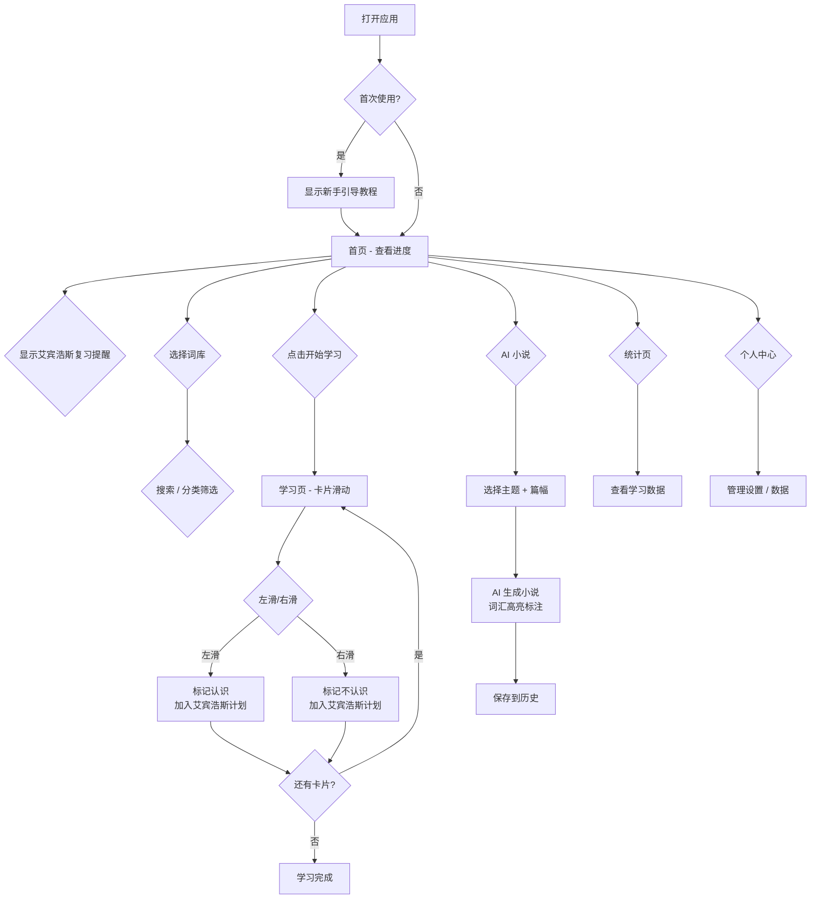

# 雅思单词背诵工具 — 产品需求文档 (PRD)

## 1. 产品概述

一款面向雅思考生的网页端单词记忆工具，通过卡片滑动交互、小说化场景记忆、艾宾浩斯智能复习等创新方式，取代传统枯燥的单词背诵体验，帮助用户高效掌握雅思核心词汇。

- **目标用户**：雅思考生及英语学习者
- **产品形态**：网页应用，无需下载安装
- **核心差异化**：Tinder 式卡片滑动 + 小说场景嵌入记忆 + 艾宾浩斯遗忘曲线智能复习 + AI 小说生成

## 2. 核心功能

### 2.1 用户角色

| 角色 | 注册方式 | 核心权限 |
|------|----------|----------|
| 学习者 | 无需注册（Demo 阶段） | 浏览首页、选择词库、滑动学单词、查看统计、生成 AI 小说、管理个人设置 |

### 2.2 功能模块

1. **首页**：问候语、词库选择器（搜索 + 分类筛选 + 最近使用）、艾宾浩斯复习提醒卡片、今日目标进度条、连续打卡天数、学习模式入口（小说模式 + AI 小说）、快速统计、开始学习按钮
2. **学习页**：Tinder 式卡片堆叠滑动、左滑认识/右滑不认识、点击展开详情、小说场景记忆卡片、艾宾浩斯自动记录、新手引导教程
3. **AI 小说页**：基于已学词汇生成中文小说、词汇高亮标注（中文后括号标英文）、主题风格选择（科幻/奇幻/悬疑）、篇幅选择（短/中/长）、生成历史记录、最多 20 个词汇限制
4. **统计页**：打卡天数、已掌握/待复习数量、每日学习量柱状图、记忆留存率环形图（艾宾浩斯）、学习时长分布、时间段分布图
5. **个人中心**：学习设置、AI 模型选择（默认/GPT-4/GPT-3.5/Claude）、API Key 管理（输入/保存/显示切换）、词库概览与进度、数据导入导出（JSON 格式）、词库重置（安全确认）

### 2.3 页面详情

| 页面名称 | 模块名称 | 功能描述 |
|----------|----------|----------|
| 首页 | 问候语 | 根据时间段显示个性化问候 |
| 首页 | 词库选择器 | 底部弹出面板，搜索 + 分类筛选 + 最近使用 |
| 首页 | 艾宾浩斯复习提醒 | 高亮显示待复习词汇数量及优先级标签 |
| 首页 | 今日目标卡片 | 显示今日学习进度条、目标数量、连续打卡天数 |
| 首页 | 模式入口 | 小说模式 + AI 小说入口卡片 |
| 首页 | 快速统计 | 已掌握/待复习数量 |
| 学习页 | 顶部导航 | 返回 + 进度 + 操作提示按钮 |
| 学习页 | 单词卡片 | 可拖拽滑动的大卡片，展示单词、音标、词性、难度 |
| 学习页 | 小说场景卡片 | 包含该单词的英文短篇小说段落及中文翻译 |
| 学习页 | 滑动提示 | 底部左右滑动含义 |
| 学习页 | 新手引导 | 首次使用四步交互教程（欢迎/左滑认识/右滑不认识/小说记忆） |
| AI 小说页 | 生成设置 | 主题风格 + 篇幅选择 |
| AI 小说页 | 生成区域 | 已掌握词汇数提示 + 生成按钮 + 生成动画 |
| AI 小说页 | 小说展示 | 词汇高亮（word（释义）格式） + 已使用词汇标签 |
| AI 小说页 | 生成历史 | 历史记录列表 |
| 统计页 | 统计卡片 | 三列数字卡片 |
| 统计页 | 每日学习量 | 7 天柱状图 |
| 统计页 | 记忆留存率 | SVG 环形进度图 + 艾宾浩斯阶段指标 |
| 统计页 | 学习时长分布 | 7 天时长柱状图 + 时间段分布 |
| 个人中心 | 学习设置 | 每日目标 + 打卡天数 + 已掌握数 |
| 个人中心 | AI 设置 | 模型选择（单选列表） |
| 个人中心 | API Key | 输入框 + 显示/隐藏 + 保存按钮 |
| 个人中心 | 词库管理 | 当前词库概览 + 词库列表 + 进度百分比 + 重置确认 |
| 个人中心 | 数据管理 | 导出按钮（剪贴板 + 下载）+ 导入按钮（文件选择） |

## 3. 核心流程

## 4. 用户界面设计

### 4.1 设计风格

- **主色调**：柔和蓝紫 `#4F6EF7` 作为强调色，搭配暖灰背景 `#F5F7FA`
- **辅助色**：成功绿 `#34C759`（认识标记）、警告红 `#FF6B6B`（不认识标记）
- **按钮样式**：大圆角（16px）、柔和阴影、点击时 scale 缩放反馈
- **字体**：Space Grotesk（标题）+ DM Sans / Noto Sans SC（正文）
- **布局**：卡片式布局，内容区最大宽度 480px 居中，移动端友好
- **图标**：Lucide React 图标库，线条风格

### 4.2 响应式设计

- 桌面端：内容最大宽度 480px，居中显示，左右留白
- 平板端：同桌面端
- 移动端：内容撑满宽度，卡片适当缩小至 300px 宽
- 触摸优化：拖拽事件同时支持 touch 和 mouse

---

> 文档版本：v2.0 | 日期：2026-07-02
