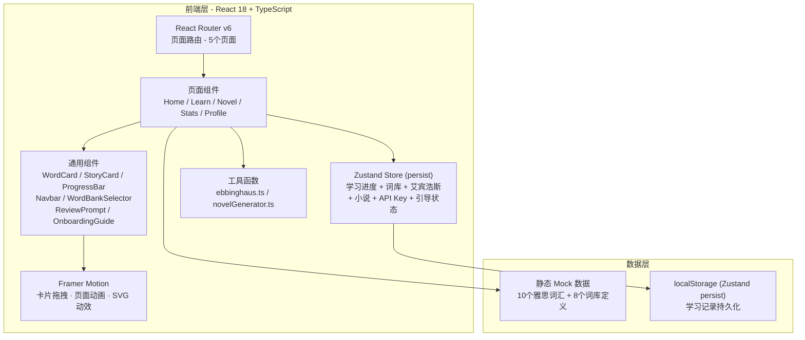
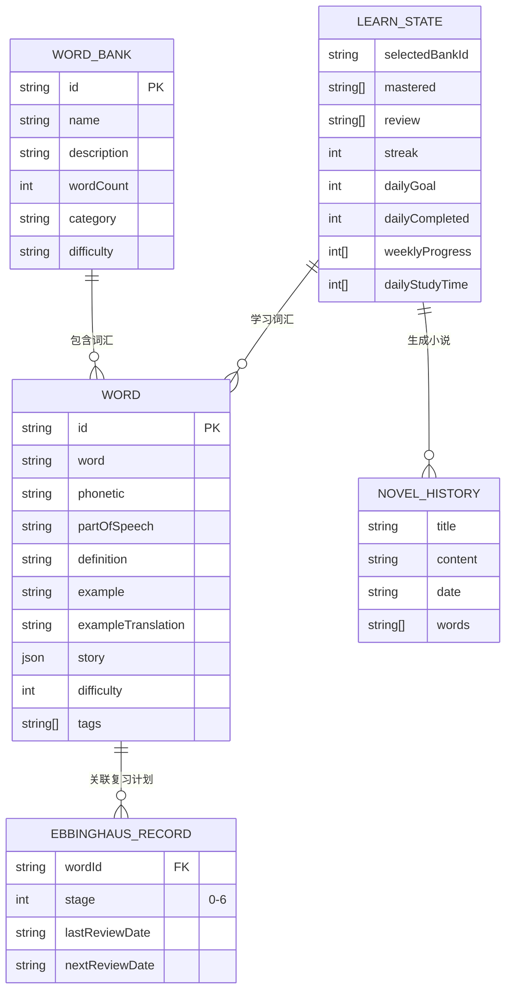

# 雅思单词背诵工具 — 技术架构文档

## 1. 架构设计



## 2. 技术说明

- **前端框架**：React@18 + TypeScript
- **初始化工具**：vite-init (react-ts 模板)
- **样式方案**：Tailwind CSS 3
- **状态管理**：Zustand (persist middleware → localStorage)
- **路由**：React Router v6
- **动画**：Framer Motion 11
- **图标**：Lucide React
- **后端**：无（Demo 阶段纯前端）
- **数据库**：无（使用 localStorage 持久化）

## 3. 路由定义

| 路由 | 页面 | 用途 |
|------|------|------|
| `/` | Home | 首页 - 学习概览、词库选择、艾宾浩斯提醒、模式入口 |
| `/learn` | Learn | 学习页 - 卡片滑动核心交互 + 新手引导 |
| `/novel` | Novel | AI 小说 - 词汇小说生成与展示 |
| `/stats` | Stats | 统计页 - 多维度学习数据可视化 |
| `/profile` | Profile | 个人中心 - 设置、AI、词库、数据管理 |

## 4. 数据模型



## 5. 核心模块技术方案

### 5.1 艾宾浩斯遗忘曲线

```typescript
// 复习间隔：1天 → 2天 → 4天 → 7天 → 15天 → 30天
const EBBINGHAUS_INTERVALS = [1, 2, 4, 7, 15, 30];

interface EbbinghausRecord {
  wordId: string;
  stage: number;         // 当前阶段 (0-6)
  lastReviewDate: string;
  nextReviewDate: string;
}

// 判断是否到期、推进阶段、创建新记录
- calculateNextReview(stage, fromDate): Date
- isDueForReview(record): boolean
- getDueWords(records): EbbinghausRecord[]
- advanceStage(record): EbbinghausRecord
- createEbbinghausRecord(wordId): EbbinghausRecord
```

### 5.2 小说生成引擎

```typescript
// Demo阶段使用模板填充，生产环境接入 AI API
- 主题支持：科幻、奇幻、悬疑
- 篇幅：短篇(~200字) / 中篇(~400字) / 长篇(~600字)
- 限制：单次最多20个词汇
- 语法：{word}（中文释义）格式自动标注
- 高亮解析：parseHighlightedText() → Array<{type, text}>
```

### 5.3 状态持久化

```typescript
// Zustand persist middleware → localStorage
partialize: (state) => ({
  selectedBankId, recentBanks,
  mastered, review,
  ebbinghausRecords,
  streak, dailyGoal, weeklyProgress, dailyStudyTime,
  novelSettings, novelHistory,
  apiKey, hasSeenOnboarding,
  reviewCompletionRate,
})
```

## 6. 项目目录结构

```
src/
├── main.tsx
├── App.tsx                      # 根组件 (5 个路由)
├── index.css                    # Tailwind + 全局样式 + 字体
├── data/
│   ├── words.ts                 # 10 个雅思词汇 + 小说场景
│   └── wordBanks.ts             # 8 个词库定义
├── store/
│   └── learnStore.ts            # Zustand Store (persist)
├── utils/
│   ├── ebbinghaus.ts            # 艾宾浩斯算法
│   └── novelGenerator.ts        # 小说生成引擎
├── pages/
│   ├── Home.tsx                 # 首页 (词库选择器集成)
│   ├── Learn.tsx                # 学习页 (新手引导集成)
│   ├── Novel.tsx                # AI 小说页
│   ├── Stats.tsx                # 统计页 (增强版)
│   └── Profile.tsx              # 个人中心
└── components/
    ├── Navbar.tsx               # 底部导航 (4 个 Tab)
    ├── WordCard.tsx             # 单词卡片 (拖拽滑动)
    ├── StoryCard.tsx            # 小说场景卡片
    ├── ProgressBar.tsx          # 进度条
    ├── ReviewPrompt.tsx         # 艾宾浩斯复习提醒
    ├── WordBankSelector.tsx     # 词库选择器 (底部面板)
    └── OnboardingGuide.tsx      # 新手引导 (4 步教程)
```

## 7. 动画清单（新增）

| 动画 | 触发条件 | 实现方式 |
|------|----------|----------|
| 词库面板弹出 | 点击词库按钮 | bottom sheet spring 动画 |
| 艾宾浩斯复习提醒 | 首次加载首页 | scale + opacity 渐入 |
| 新手引导步骤切换 | 点击下一步 | x 轴滑动切换 |
| AI 生成 loading | 生成中 | Sparkles 图标旋转 |
| 小说展示 | 生成完成 | y + opacity 渐入 |
| SVG 环形图 | 统计页显示 | strokeDasharray 动画 |
| 学习时长柱状图 | 统计页显示 | height 渐入 |
| 时间段分布图 | 统计页显示 | height 渐入 |

---

> 文档版本：v2.0 | 日期：2026-07-02
